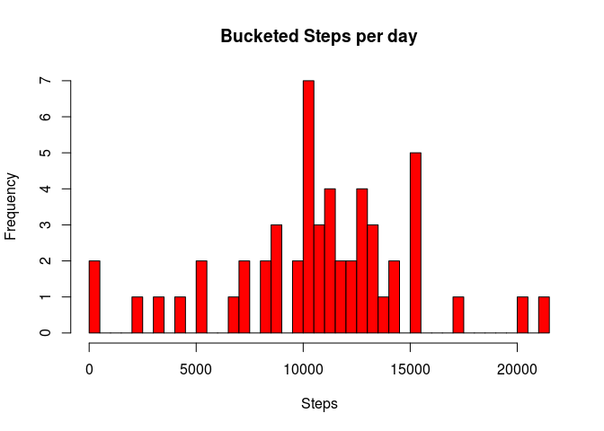
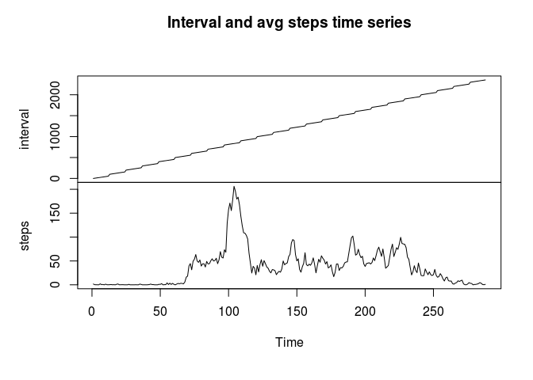
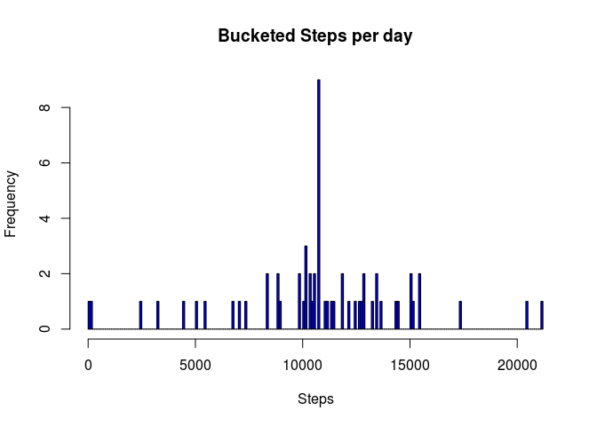
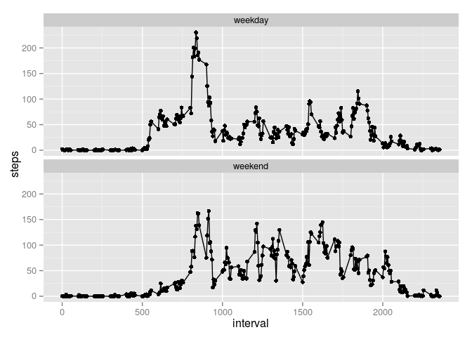

# fitstuf
cdepeuter  
02/15/2015  

#Peer assessment 1


```r
library(plyr)
library(dplyr)
```

```
## 
## Attaching package: 'dplyr'
## 
## The following objects are masked from 'package:plyr':
## 
##     arrange, count, desc, failwith, id, mutate, rename, summarise,
##     summarize
## 
## The following object is masked from 'package:stats':
## 
##     filter
## 
## The following objects are masked from 'package:base':
## 
##     intersect, setdiff, setequal, union
```

```r
library(ggplot2)
library(lubridate)
```

```
## 
## Attaching package: 'lubridate'
## 
## The following object is masked from 'package:plyr':
## 
##     here
```

Grouping the data by day, and summing the steps over the groups:


```r
#put data in a data frame
dt_na<-tbl_df(read.csv("activity.csv"))
#remove NAs from data
dt<-dt_na[complete.cases(dt_na),]
#group the data by day
dt_by_d<- dt %>% group_by(date) %>% summarize(steps = sum(steps))
hist(dt_by_d$steps, breaks=50, xlab = "Steps", main = "Bucketed Steps per day", col="red")
```

 


Now, grabbing mean and median.


```r
median <- median(dt_by_d$steps)
mean <- mean(dt_by_d$steps)
```

We get 1.0766189\times 10^{4} as the mean, and 10765 as the median steps per day.


```r
#get averages of steps in each interval
dt_by_g<- dt %>% group_by(interval) %>% summarize(steps = mean(steps))
index_of_max <- which.max(dt_by_g$steps)
max_interval<- dt_by_g[index_of_max,]$interval
#get data in a time series
ts<-ts(dt_by_g)
plot.ts(ts, main="Interval and avg steps time series")
```

 


The interval with the largest average steps is 835

Moving onto part 3 of the assignment, we will use the dataset with NA's

```r
num_invalid <- sum(!complete.cases(dt_na))
```

There are 2304 missing values in the dataset. To fill these values, we will take the mean for that 5 minute interval. Below is the histogram of steps in a day with the new data.


```r
#replacing data, using the dt_by_g which will get the mean for that interval
dt_repi<-dt_na
nas<-which(is.na(dt_na$steps))
for(i in nas){
     int<-dt_na[i,]$interval
     dt_repi[i,1]<-dt_by_g[which(dt_by_g$interval==int),]$steps
}

#repeat the calculations on the new dataset
dt_by_d_rep<- dt_repi %>% group_by(date) %>% summarize(steps = sum(steps))
median_rep <- median(dt_by_d_rep$steps)
mean_rep <- mean(dt_by_d_rep$steps)
hist(dt_by_d_rep$steps, breaks=200, xlab = "Steps", main = "Bucketed Steps per day", col="blue")
```

 


The dataset now has a much more concentrated centeer and the same max and mins. This makes sense since we introduced a lot of new data points which were mean value.
We get 1.0766189\times 10^{4} as the new mean, and 1.0766189\times 10^{4} as the new median steps per day. The mean is the same as before since we introduced means to the dataset.
Also, since we replaced NAs with the means, which arent integer values, the median can be a non integer as well.

Now, were going to look at weekdays or weekends, we need to figure out if each day is a weekday or weekend.


```r
#get "weekend" column. Only days of week with "S" are saturday and sunday

dt_repi<-mutate(dt_repi, dow = as.character(weekdays(ymd(date))), weekend = ifelse(grepl("S", dow), "weekend", "weekday"))
grouped_weekends <- dt_repi %>% group_by(interval, weekend) %>% summarize(steps = mean(steps))
qplot(interval, steps, data=grouped_weekends)+geom_line()+facet_wrap(~weekend, ncol=1)
```

 

The highest level activity times for weekdays are early in the day, and its more constant over weekends, as expected. Very early and very late are less active for both, and activity stays high a little later on weekends.
